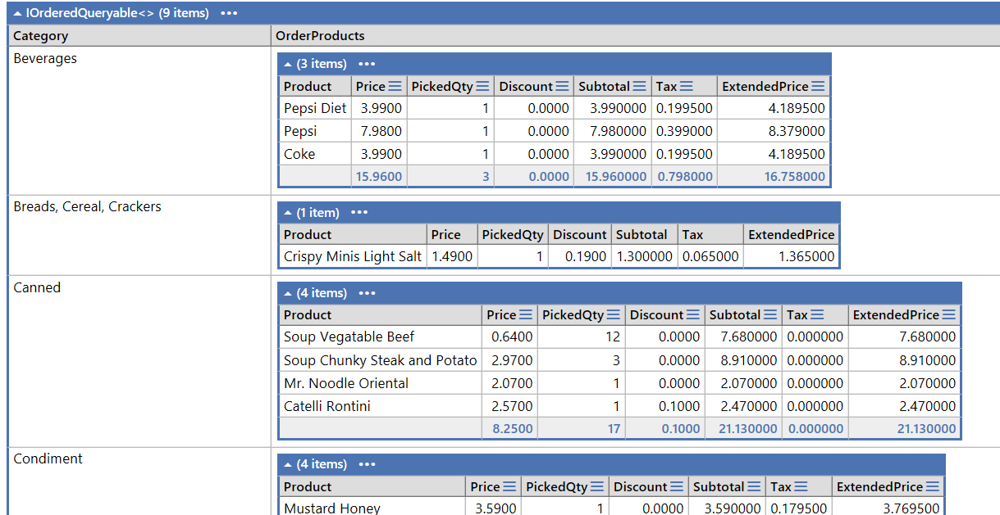
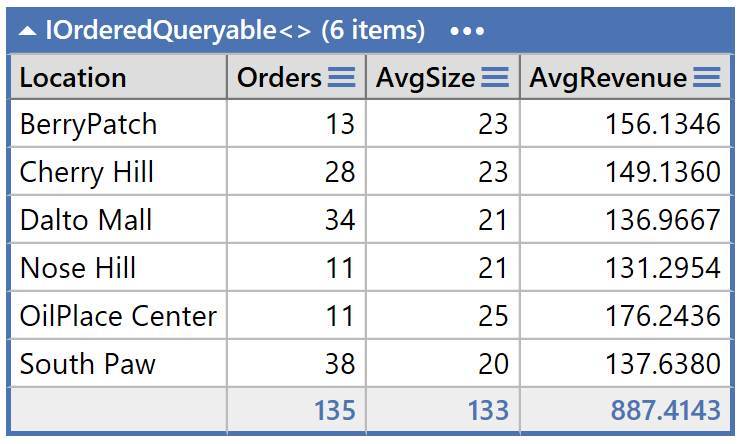
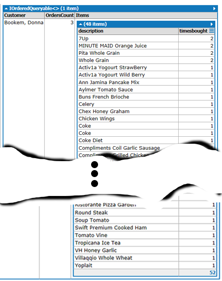

# Linq Query Exercise 

## Marking Rubric 

| Earned  | Marks | Section                           |
| :-----: | :---: | --------------------------------- |
|   |   2   | Question 1    |
|   |   2   | Question 2    |
|   |   2   | Question 3    |
|   |   2   | Question 4    |
|   |   2   | Question 5    |
|   |   2   | Question 6    |
|   |  -2   | Penalties Max -2 (e.g.: milestone and or issue missing, insufficient commits)* |
|   |  12   | **Total** |

### Marking Rubric

| Weight | Breakdown |
| ----   | --------- |
| **2** | 2 = Proficient (requirement is met) 1 = Limited (requirement is satisfactorily met, several errors) 0 = Incomplete (requirement poorly/not met, major errors, missing large portions) |

----

[Back to Exercises](../ReadMe.md)

> Private Classroom GitHub Repo Only

This exercise is based on the GroceryList database (found at the root of this repository). For this exercise, provide your answers as LinqPad (.linq) document(s). Use either A) a single LinqPad document for each question (you will use Expressions as the LinqPad environment) or B) a single LinqPad document containing all questions (you will need to use Statements as the LinqPad environment). You **must** do a commit after completing each question.

## Query 1

Create a product list which indicates what products are purchased by our customers and how many times that product was purchased. Order the list by most popular product then by alphabetic description.

## Query 2

We want a mailing list for a Valued Customers flyer that is being sent out. List the customer addresses for customers who have shopped at each store. List by the store. Include the store location as well as the customer's address. Do NOT include the customer name in the results.

## Query 3

Create a Daily Sales per Store request for a specified month. Order stores by city by location. For Sales, show order date, number of orders, total sales without GST tax and total GST tax.

## Query 4

Print out all product items on a requested order (use Order #33). Group by Category and order by Product Description. You do not need to format money as this would be done at the presentation level. Use the QtyPicked in your calculations. Hint: You will need to using type casting (decimal). Use of the ternary operator will help.

## Query 5

Generate a report on store orders and sales. Group this report by store. Show the total orders, the average order size (number of items per order) and average pre-tax revenue.

## Query 6

List all the products a customer (use Customer #1) has purchased and the number of times the product was purchased. Order by number of times purchased then description.

