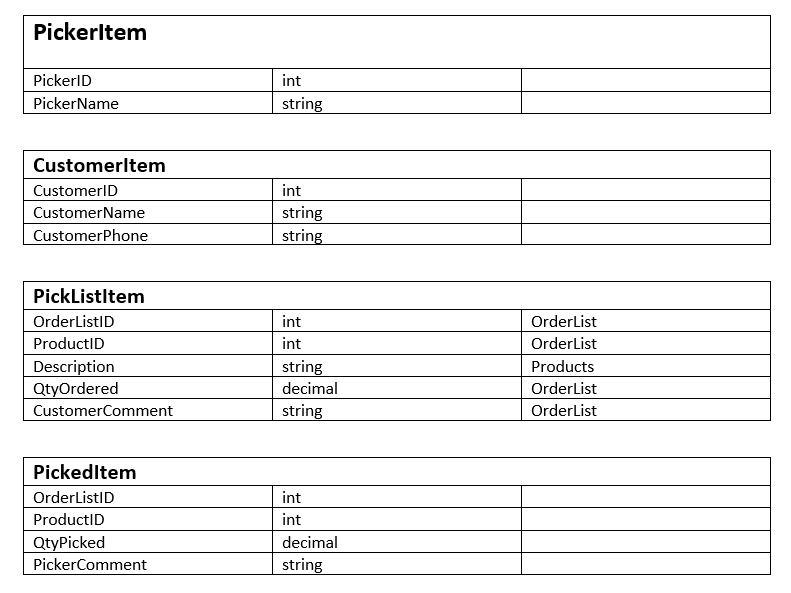
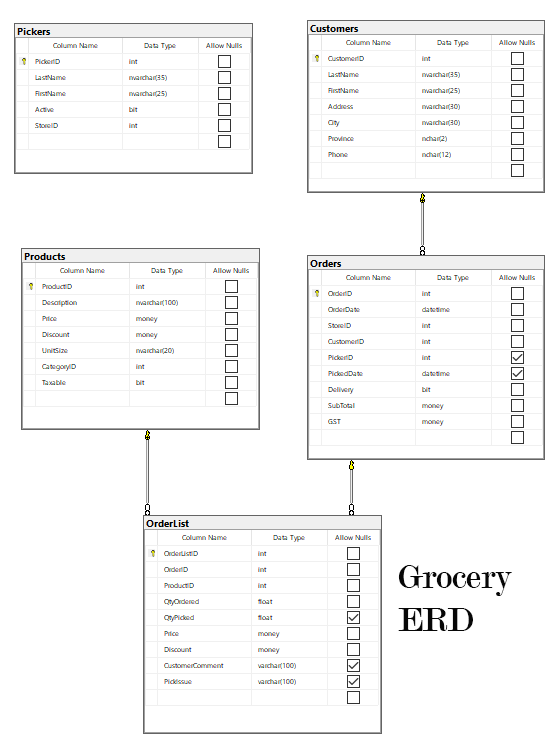

# OLTP Transaction Development Exercise 

## Marking Rubric 

| Earned  | Marks | Section                           | Comments                                           |
| :-----: | :---: | --------------------------------- | -------------------------------------------------- |
|   |   1   | Development Components as requested    |   |
|   |   1   | Reverse Engineer required entities (Dbcontext, Entities, access internal)  |   |
|   |   1   | CQRS Data Model(s) (picking , picker, customer information; command data model )   |   |
|   |   1   | Implementation of Query Service Method(s) (FETCH covers picker, customer, order details and data display)   |   |
|   |   1   | Implementation of Command Service Method (transaction for processing picking information)  |   |
|   |   1   | Implementation of services registration.  |   |
|   |   1   | menu setup  |    |
|   |   3   | Implementation of Order Display web page  |    |
|   |   5   | Implementation of Picking recording web page - form creation  |    |
|   |   2   | Implementation of the Fetch Processing event  |    |
|   |   2   | Implementation of the Save Processing event |    |
|   |   1   | Implementation of Clear Processing  |    |
|   |  -4   | Penalties Max -4 (e.g.: milestone and or issue missing, insufficient commits, non-informative commit messages)* |
|   |  20   | **Total** |

### Marking Rubric

| Weight | Breakdown |
| ----   | --------- |
| **1** | 1 = **Proficient** (requirement is met) 0 = **Incomplete** (requirement poorly/not met, major errors, missing large portions) |
| **2** | 2 = **Proficient** (requirement is met) 1 = **Limited** (requirement is satisfactorily met, several errors) 0 = **Incomplete** (requirement poorly/not met, major errors, missing large portions) |
| **3** | 3 = **Proficient** (requirement is met, no recommendations) 2 = **Satisfactory** (requirement met, minor/missing errors/details ) 1 = **Limited** (requirement is satisfactorily met, major/missing errors/details) 0 = **Incomplete** (requirement poorly/not met, major errors, missing large portions) |
| **4** | 4 = **Proficient** (requirement is met) 3 = **Capable** (requirement is adequately met, minor errors) 2 = **Acceptable** (most requirements are adequately met, minor errors) 1 = **Limited** (requirement is poorly met, major errors) 0 = **Incomplete** (requirement not met, missing large portions) |
| **5** | 5 = **Proficient** (requirement is met) 4 = **Capable** (requirement is met, minor errors) 3 = **Satisfactory** (majority of requirement met, minor/missing errors/details ) 2 = **Acceptable** (requirement is adequately met, minor/missing errors/details) 1 = **Limited** (requirement is poorly met, major errors) 0 = **Incomplete** (requirement not met, missing large portions) |

----

[Back to Exercises](../README.md)

----
Given the following user-interface form, using your transaction service methods (or methods supplied), create a working web page that will allow a user to enter picking information and send it to your class library for recording on the database. Create a second page that will take in an order id and return the order id, picker id, picked date, subtotal, gst and a collection of orderlist details for the order id. The second page will display the data.
Follow the guidance and examples given by your instructor for your integrating your service method with the web form. 

The form is designed to collect the order picking information. The form is designed to collect the picking information of an order after the picker has collected the items. The form will display the original order. The picker would have taken a copy of the original order, went through the store collecting the items on the order. Record the picked quantities on the order. Finally, returned the sheet to the office for entry by the clerk. The entire form will be processed as a single transaction in the BLL.

## Processes

- Fetch: order number and picker id
  - obtains and displays Picker name, Customer information (3), order details (2)

- Clear
  - clears form

- Save
  - collects data from the form and submits for processing
    - order number, picker id, table data
 
## Proposed Query/Command Data Models

## Requirements:

1. Create a new solution containing a web application and class library
    - Please name your ConnectionStrings to **OLTPDB** 
1. Create two new menu items to access 
    - Data display page for order
    - Record Picking data entry page. 
1. Reverse engineer the tables in the supplied ERD. Content and Entity classes are to have an access of internal.
1. Implement code to register your serivce methods and dbcontext. Use your class demonstration as a guideline in setting this up. Use User Secrets for your connection string. 
1. Implement your service methods and CQRS data models within the class library. **A set of methods and models have been supplied for you to use if you wish. They have been tested and work.**
1. Create the data display page for the order. It should have a form to accept an order id and fetch the requested data (see above). Add a reset button to your form to clear the form.
1. Create a web page using the mockup diagram to collect your picking information. The processes for this page are listed above. Collect the necessary data from all the orderlist detail lines to submit along with the orderid and pickerid.  

