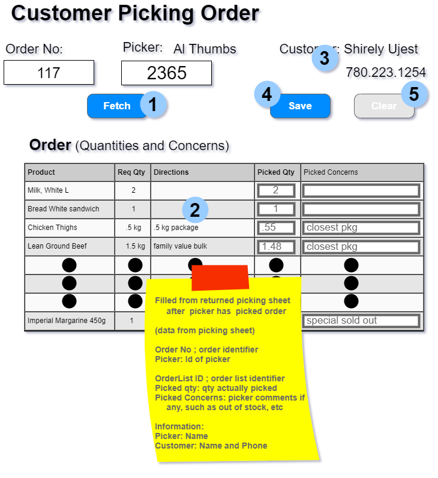

# OLTP Transaction Development Exercise 

## Marking Rubric 

| Earned  | Marks | Section                           | Comments                                           |
| :-----: | :---: | --------------------------------- | -------------------------------------------------- |
|   |   1   | Development Components as requested    |   |
|   |   1   | Query Data Model(s) (covers picker, customer, order details)  |   |
|   |   1   | Command Data Model(s) (picking information)   |   |
|   |   3   | Implementation of Query Service Method(s) (FETCH covers picker, customer, order detials)   |   |
|   |   5   | Implementation of Command Service Method (Save covers transaction for processing picking information)  |   |
|   |   3   | Driver routine with error handling Query services  |    |
|   |   3   | Driver routine with error handling Command services  (testing good and bad data) |    |
|   |   3   | Command Test Data collections (good, bad for validation checking)  |    |
|   |  -4   | Penalties Max -4 (e.g.: milestone and or issue missing, insufficient commits, non-informative commit messages)* |
|   |  20   | **Total** |

### Marking Rubric

| Weight | Breakdown |
| ----   | --------- |
| **1** | 1 = **Proficient** (requirement is met) 0 = **Incomplete** (requirement poorly/not met, major errors, missing large portions) |
| **2** | 2 = **Proficient** (requirement is met) 1 = **Limited** (requirement is satisfactorily met, several errors) 0 = **Incomplete** (requirement poorly/not met, major errors, missing large portions) |
| **3** | 3 = **Proficient** (requirement is met, no recommendations) 2 = **Satisfactory** (requirement met, minor/missing errors/details ) 1 = **Limited** (requirement is satisfactorily met, major/missing errors/details) 0 = **Incomplete** (requirement poorly/not met, major errors, missing large portions) |
| **4** | 4 = **Proficient** (requirement is met) 3 = **Capable** (requirement is adequately met, minor errors) 2 = **Acceptable** (most requirements are adequately met, minor errors) 1 = **Limited** (requirement is poorly met, major errors) 0 = **Incomplete** (requirement not met, missing large portions) |
| **5** | 5 = **Proficient** (requirement is met) 4 = **Capable** (requirement is met, minor errors) 3 = **Satisfactory** (majority of requirement met, minor/missing errors/details ) 2 = **Acceptable** (requirement is adequately met, minor/missing errors/details) 1 = **Limited** (requirement is poorly met, major errors) 0 = **Incomplete** (requirement not met, missing large portions) |

----

[Back to Exercises](../README.md)

----

Using your documentation plan from your Implementation Planning exercise, test your plan by coding a working solution testing **each** service method using Linqpad. Incorporate any missed issues from the Implementation Planning exercise outlined by your instructor's review. **Follow the guidance and examples given by your instructor for your implementation.** 

The form is designed to collect the order picking information. The form is designed to collect the picking information of an order after the picker has collected the items. The form will display the original order. The picker would have taken a copy of the original order, went through the store collecting the items on the order. Record the picked quantities on the order. Finally, returned the sheet to the office for entry by the clerk. The entire form will be processed as a single transaction in the BLL.

## Processes

- Fetch: order number and picker id
  - returns Picker name, Customer information (3), order details (2)

- Clear
  - clears form

- Save
  - collects data from the form and submits for processing
    - order number, picker id, table data
 
## Proposed Query/Command Data Models

## Requirements:

1. Each query/command service method is to be coded in a separate linq file.
1. Each file consists of 
   -  driver routine (Main)
   -  appropriate data model (class)
   -  service method (query/command)
   -  user friendly error handling
1. Test data creation for command service implementation
   -  good test data collection
   -  bad data collection 
1. Command service file will require displays (dump) of original data and modified data to show differences.

